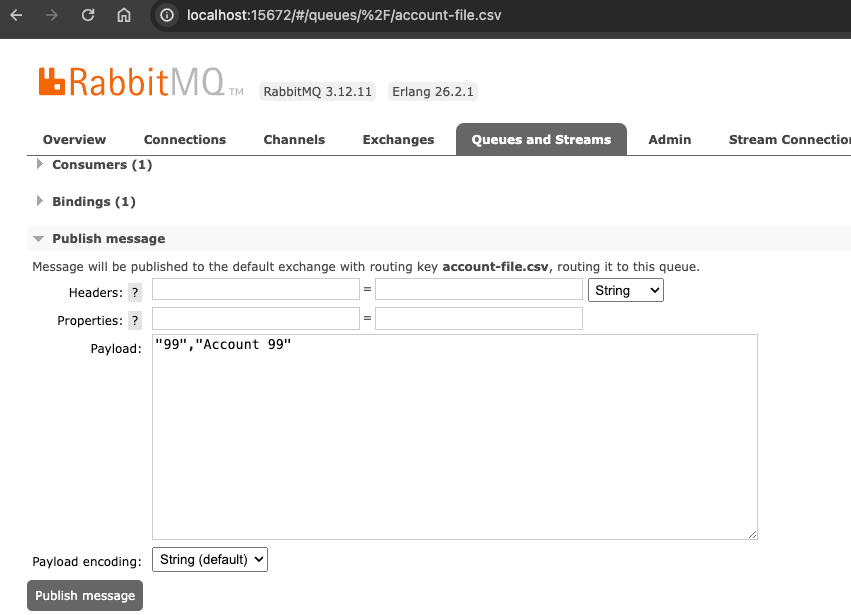

# account-csv-processor

A simple developer defined [spring cloud stream](https://spring.io/projects/spring-cloud-stream) processor app to convert CSV data to a domain object.
This app can be added to a library of apps to be used within [SCDF](https://spring.io/projects/spring-cloud-dataflow). 

-----------------------

# Local Testing

## Start GemFire

```shell
./deployments/local/scripts/gemfire/start.sh
```

[Setup and Install SCDF](https://dataflow.spring.io/docs/installation/local/manual/)

------------------------
## Start RabbitMQ

See [RabbitMQ documentation](https://www.rabbitmq.com/docs/download)

##  Start SCDF

Start Skipper
```shell
java -jar $SCDF_HOME/spring-cloud-skipper-server-2.11.2.jar  
```

Start DataFlow
```shell
java -jar $SCDF_HOME/spring-cloud-dataflow-server-2.11.2.jar --server.port=9393  --spring.cloud.dataflow.features.skipper-enabled=true 
```

Access the Spring DataFlow Dashboard

```shell
open http://localhost:9393/dashboard
```

Goto Click [Apps](http://localhost:9393/dashboard/index.html#/apps) ->[Add](http://localhost:9393/dashboard/index.html#/apps/add)

- Click import application starters -> RabbitMQ/Maven -> Import Applications
- Click App as Properties

Paste the following with the locations of GemFire SCDF and custom apps


```properties
sink.gemfire=file:///Users/devtools/repositories/IMDG/gemfire/scdf/apps/gemfire-sink-rabbit-1.0.0.jar
source.account-file=file:///Users/Projects/VMware/Tanzu/TanzuData/TanzuGemFire/dev/spring-gemfire-showcase/applications/account-file-supplier/target/account-file-supplier-0.0.1-SNAPSHOT.jar
processor.account-csv-json=file:///Users/Projects/VMware/Tanzu/TanzuData/TanzuGemFire/dev/spring-gemfire-showcase/applications/account-csv-processor/target/account-csv-processor-0.0.1-SNAPSHOT.jar
```

Note: please update the URI based on built the custom apps and location of the downloaded GemFire for Spring Cloud DataFlow applications

--------------------------------
# RabbitMQ Queue with CSV lines to GemFire Example

- Click [Streams](http://localhost:9393/dashboard/index.html#/streams/list) ->  [Create](http://localhost:9393/dashboard/index.html#/streams/list/create)
- Paste the following example


In RabbitMQ Dashboard


Create CSV Quorum Queue the following name:
```
account-file.csv
```

Access the Spring DataFlow Dashboard

```shell
open http://localhost:9393/dashboard
```


Create Stream the following definition

```shell
csv=rabbit  --queues=account-file.csv | account-csv-json | gemfire --gemfire.region.regionName=Account --gemfire.consumer.keyExpression="payload.getField('id')" --gemfire.consumer.json="true" --gemfire.pool.host-addresses="localhost:10334" --spring.rabbitmq.host=localhost
```

Use the RabbitMQ dashboard to add CSV lines in the account-file.csv queue




```csv
"C2","CSV Account C2"
```


------------------
# CSV File to GemFire  Example


Click Create stream(s)
- type name
- Click the ":" next to the stream 
- Click Deploy -> Deploy Stream 


You also deploy the following

```shell
csv-file=file --directory=/tmp/input --filename-pattern=account.csv --mode=lines | account-csv-json | gemfire --gemfire.region.regionName=Account --gemfire.consumer.keyExpression="payload.getField('id')" --gemfire.consumer.json="true" --gemfire.pool.host-addresses="localhost:10334"
````


Test with CSV File

```shell
echo '"77","Account 77"' > /tmp/input/account.csv
```

```shell
echo '"ABC66","Account ABC66"' >> /tmp/input/account.csv
```

-----------------------

# Postgres to GemFire

```shell
docker  run --name postgresql  --network gemfire-cache --rm -it -p 5432:5432 -e ALLOW_EMPTY_PASSWORD=yes -v /Users/devtools/repositories/RDBMS/PostgreSQL/pg-docker:/bitnami/postgresql bitnami/postgresql:latest
```

Run initial to test and create database

```shell
docker run -it --rm  --network gemfire-cache bitnami/postgresql:latest psql -h postgresql -U postgres
```

```sql
CREATE TABLE IF NOT EXISTS account_queue (
	id varchar(100) NOT NULL,
	"name" varchar(255) NOT NULL,
	"processed" varchar(1) not null DEFAULT 'N',
	CONSTRAINT account_queue_pk PRIMARY KEY (id)
);
```

Deploy the following SCDF definition

```shell
database=jdbc --spring.datasource.url="jdbc:postgresql://localhost:5432/postgres" --spring.datasource.username=postgres --update="UPDATE account_queue SET processed = 'Y' where processed = 'N'" --query="select id,name from account_queue where processed = 'N'" | gemfire --gemfire.region.regionName=Account --gemfire.consumer.keyExpression="payload.getField('id')" --gemfire.consumer.json="true" --gemfire.pool.host-addresses="localhost:10334"
```


Test with the following

```sql
INSERT INTO account_queue (id, "name") VALUES('DB3', 'Account DB3');
```


-------------------------
# Notes

Update or create New File in the directory (ex: [/Users/Projects/VMware/Tanzu/TanzuData/TanzuGemFire/dev/spring-gemfire-showcase/applications/account-csv-processor/src/test/resources/csv/account/account.csv](https://github.com/ggreen/spring-gemfire-showcase/blob/main/applications/account-csv-processor/src/test/resources/csv/account/account.csv))

Example data

```csv
"1","First Account"
"2","Second Account"
"3","Third Account"
"4","Fourth Account"
```


View data in GemFire

```shell
cd $GEMFIRE_HOME/bin
./gfsh -e "connect"  -e "query --query='select * from /Account'"
```

